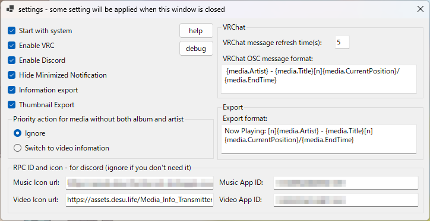

# Media_Info_Transmitter

Media/Music info transmitter for VRChat & Discord.
The music information currently being played can be displayed on both platforms.

## Screenshots

Here are some screenshots of this:

### Screenshot 1

### Screenshot 2

### Screenshot 3

### Screenshot 4

### Screenshot 5

### Screenshot 6

### Screenshot 7

## Installation

You can get the latest release from [GitHub Releases](https://github.com/Monodesu/Media_Info_Transmitter/releases) and use it.
